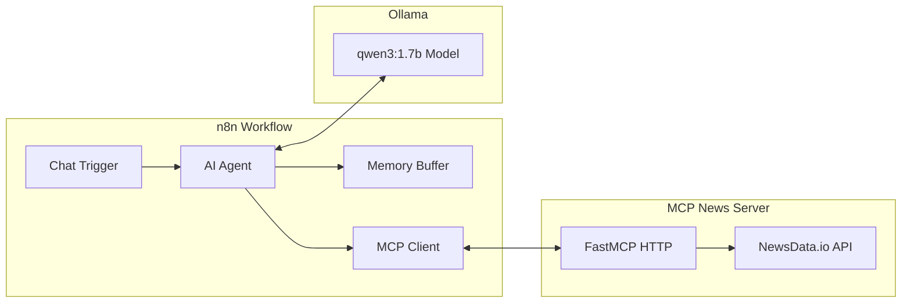

# n8n MCP Integration Demo


> Developer resource demonstrating custom Model Context Protocol (MCP) server integration with n8n workflows.

[Overview](#overview) • [Getting started](#getting-started) • [MCP Integration](#mcp-integration) • [Components](#components)

## Overview

This project demonstrates how to integrate custom MCP servers with n8n workflows using a news data example:

- **Custom MCP Server**: NewsData.io API integration with proper MCP protocol implementation
- **n8n Workflow**: Pre-built workflow showing MCP tool usage with AI agents
- **Local Development**: Complete Docker setup with Ollama for offline testing

The implementation provides a practical template for extending n8n with custom data sources through the Model Context Protocol.


## Getting Started

> **⚠️ Performance Notice**: Chat requests may take significant time to process depending on your hardware. CPU-only inference can be slow - consider using GPU acceleration if available.

### Requirements

- [Docker](https://www.docker.com/get-started/) with Compose
- [NewsData.io API key](https://newsdata.io/register) (free tier: 200 requests/day)

### Setup

**1. Configure NewsData.io API**

Create `mcp-newsdataapi/.env` file:
```env
NEWS_API_KEY=your_api_key_here
```

**2. Start the stack**

Choose one of the following options:

**CPU-only (default):**
```powershell
docker compose up -d
```

**With NVIDIA GPU acceleration:**
```powershell
docker compose -f compose.yml -f compose.nvidia.yml up -d
```

> The initial startup downloads the Qwen 3:1.7b model (~1GB). Monitor with `docker compose logs ollama`.

**3. Access the applications**

| Service | URL | Purpose |
|---------|-----|---------|
| n8n | http://localhost:8888 | Workflow builder |
| MCP Server | http://localhost:8000 | News API endpoint |

**4.** Proceed to the **Usage** section below...


## Usage

Finish the setup by configuring the n8n workflow.

1. Open n8n at http://localhost:8888 (admin@localhost.local / securepassword)
2. Import the workflow from `n8n/news-agent-chat.json`
3. Configure Ollama credentials: `http://ollama:11434`

4. Activate the workflow to start the chat interface

The AI agent can search news, provide summaries, and maintain conversation context using the MCP tools.

## MCP Integration

### Server Implementation

The MCP server uses FastMCP with HTTP transport for n8n compatibility:

```python
@mcp.tool()
def search_news(query: str, max_pages: int = 1, ctx: Context = None) -> str:
    """Search for news articles by keyword with pagination support."""
    articles = fetch_news(query=query, max_pages=max_pages)
    return format_articles(articles)
```

### n8n Configuration

1. Add MCP Client node with SSE endpoint: `http://mcp-newsdataapi:8000/sse`
2. Connect to AI Agent's tool input
3. Configure conversation memory buffer
4. Test tool discovery and execution

## Components



### n8n Workflow

Pre-configured workflow with:
- Chat trigger for user interactions
- AI Agent with MCP tool integration
- Memory buffer for conversation context
- Ollama integration for local LLM

### MCP NewsData Server

Custom MCP server providing:
- `get_latest_news()`: Current headlines
- `search_news(query, max_pages)`: Keyword search with pagination
- `summarize_news(query)`: Summary generation prompts

### Ollama

Local AI inference with `qwen3:1.7b` model, providing OpenAI-compatible API.

## Troubleshooting

**Common issues:**

- **Model download fails**: `docker compose logs ollama && docker compose restart ollama`
- **Workflow not responding**: Verify Ollama credentials point to `http://ollama:11434`
- **MCP connection issues**: Check SSE endpoint accessibility at `http://mcp-newsdataapi:8000/sse`
- **API errors**: Confirm `NEWS_API_KEY` in `mcp-newsdataapi/.env`

## Whats Next?

- Explore additional MCP tools for different data sources
- Extend n8n workflows with more complex AI interactions
- Set `N8N_TEMPLATES_ENABLED=true` on n8n and use [community templates](https://n8n.io/workflows).